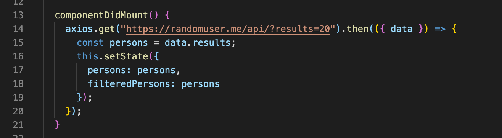

[Employee Directory](https://young-island-22114.herokuapp.com/)

# HW19-employeeDirectory

In this assignment I was required to create an employee directory where you can search for employees via search bar or by sorting a column in a table. The assignment is a front end based assignment showcasing recently acquired React skills.

## Use Cases

This app is useful to organize a large database of employees. The table displays valuable info such as phone number, email and DOB.

## Tech

This app is build primarily with React. There is no back end or db so the employee information is randomly sellected with an API call to aqcuire "random users" or employees.(shown below).

